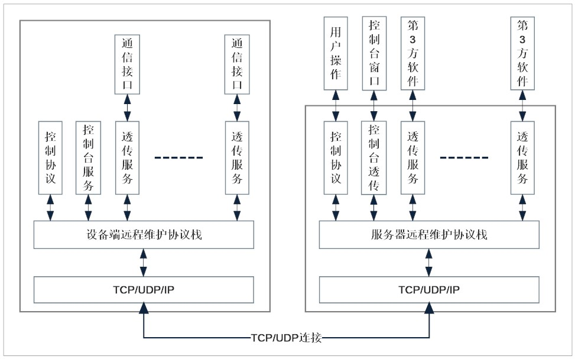
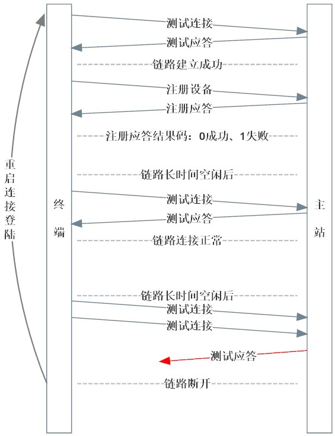
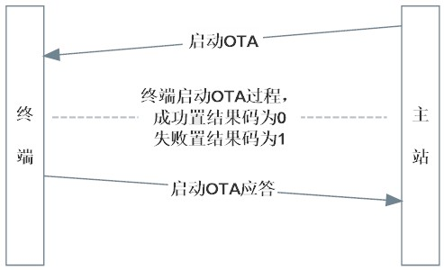
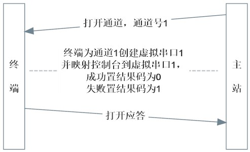

# 终端设备远程维护协议 V1.0
----------

## 概述

#### 本通信协议是专门针对终端设备远程维护而设计，协议可基于TCP或UDP传输方式工作，推荐使用TCP传输；采用客户端/服务器工作模式，终端设备作为客户端主动连接到设备远程维护主站；设备远程维护主站作为服务器接受终端设备连接请求；终端设备与维护主站建立TCP或UDP连接后，首先须在主站完成注册登陆，然后主站就可以对已登陆设备进行远程维护操作。本协议目前可提供以下几项功能（未来会不断扩展）：

- #### 1）通信链路测试：此项功能，一是在TCP或UDP刚建立连接后，测试通信链路是否正常，二是在链路空闲时做为心跳维持链路活性。
- #### 2）设备注册登陆：通信链路建立后，首先设备须主动向主站注册设备信息，信息包括但不限于以下几项：设备MAC地址、设备型号名称、固件版本信息、可用通道信息等。主站根据注册信息可选择接受其登陆，也可拒绝其登陆。
- #### 3）启动固件升级：设备注册登陆后，主站可向终端设备下发启动固件升级命令，命令中包含固件存放地址，终端可在接收到启动固件升级命令后，从指定地址下载固件升级包，并完成固件升级。
- #### 4）通道打开/关闭：主站可下发命令打开/关闭终端设备支持的通道，从而在终端与主站间建立起特定功能的透传通信，为终端维护提供通信支持。协议最多支持16个通道，其中0号通道为控制协议通道，它是在协议栈启动时被建立和使用的通道；1号通道为终端控制台通道，主站可通过此通道直接连接终端设备的控制台，实时查看运行日志、线程运行信息、内存使用情况、修改运行参数、运行或执行定制的故障诊断程序等；其它通道为数据透明传输通道，可在设备的指定通信接口与第3方维护软件之间构建一条通信通道，从而使得第3方维护软件可直接对附属设备进行远程维护，这里的附属设备是指连接在终端通信接口上的其它设备。

#### 协议工作原理示意图：

----------

## 协议帧结构

|字段|长度|说明|
|--|--|--|
|帧头|2字节|固定为：0x52 0x4D|
|通道及数据长度|2字节|高4位为通道号，低12位为数据域长度|
|数据域校验|2字节|数据域所有数据的CRC16值|
|数据域|1~4095字节|传输的载荷数据|

#### 说明：
- #### 协议字节序为：高字节在前，低字节在后。
- #### CRC16计算多项式为：Poly = x16+x15+x2+1 (IBM,SDLC) 。
- #### CRC16计算初始值为：0xFFFF。
- #### 共有16个可用通道，其中0号通道为控制协议通道，1号通道为终端控制台通道，其它为用户数据传输通道。
- #### 协议上行可使用TCP、UDP传输方式，推荐使用TCP传输。
- #### 协议下行将每个打开的通道映射成一个虚拟字符设备，应用可通过对虚拟设备的读写操作，完成数据传输。

----------

## 控制协议结构

|字段|长度|说明|
|--|--|--|
|命令码|1字节|详见命令说明|
|通道号|1字节|取值范围 0~31|
|参数或数据|n字节|详见命令说明|

- ### 命令码列表：

|命令名称|命令码|通道号|参数或数据|
|--|--|--|
|测试连接        |  0 |0         |无|
|测试应答        |  1 |0         |无|
|注册设备        |  2 |0         |n字节设备信息和可用通道信息，格式详见说明|
|注册应答        |  3 |0         |1字节结果码，结果码含义详见列表|
|启动OTA        |  4 |0         |n字节固件地址(uri)|
|启动OTA应答     |  5 |0         |1字节结果码|
|打开通道        |  6 |1~15 |无|
|打开应答        |  7 |1~15 |1字节结果码|
|关闭通道        |  8 |1~15 |无|
|关闭应答        |  9 |1~15 |1字节结果码|
|配置串口        |10 |1~15 |配置字符串，如：`115200 8n1`|
|配置应答        |11 |1~15 |1字节结果码|

> #### 注册信息格式说明：信息使用字符串格式键值对表示，键值对之间以逗号分隔。信息包括设备地址、名称、可用通道等信息。如：`mac:112233445566,product:accm-hv1.0-n32g452cc,fw-ver:v1.02 2022.07.08,ch1:console,ch2:rs485`

- ### 结果码列表：

|结果码|含义|
|--|--|
|  0   |成功|
|  1   |失败|
|  2   |通道不存在|
|  3   |不支持配置|
|  4   |连接断开|
|  255 |超时|

----------

## 协议主要的交互流程

- ### 连接登陆交互过程示意图:

- ### 启动OTA交互过程示意图:

- ### 远程控制台建立交互过程示意图:

- ### 远程控制台关闭交互过程与建立过程类似，不再赘述。
- ### 透传通道建立与关闭过程与远程控制台建立与关闭过程一样，不再赘述。

----------

## 联系方式

- #### 作者：qiyongzhong
- #### 源码：https://github.com/qiyongzhong0/rt-thread-drmp
- #### 源码：https://gitee.com/qiyongzhong0/rt-thread-drmp
- #### 邮箱：917768104@qq.com

